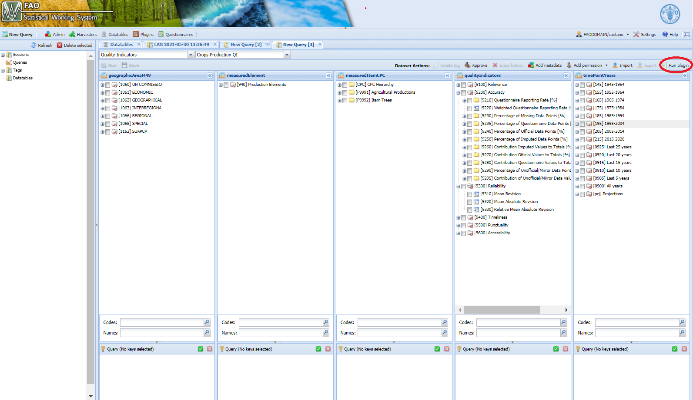

# **The plugins** {#plugins}

To provide a better experience to the SWS user, it was developed two plugins to calculate the QI, the _so-called_ standard plugin `faoswsQualityIndicators` and the flexible one, ´faoswsQITailored´.

The following sessions present both plugins and their specifications. 

## **faoswsQualityIndicators**

The `faoswsQualityIndicators` plugin has a well-defined workflow, from input data $\Rightarrow$ reference files $\Rightarrow$ data manipulation $\Rightarrow$ quality indicator computation $\Rightarrow$ final output.

```{r fig.align='center', echo=FALSE, out.width="80%", fig.cap='Workflow of the faoswsQualityIndicators module in the SWS for Crops Production'}
knitr::include_graphics('images/workflow_plugin_qi.png', dpi = NA)
```

As shown in the above workflow, the input for the QI is the output of a data cycle process (data that goes to dissemination). Thus, after getting the aggregates at area and item level, the QI functions can be applied.
Although the process is simple and requires no human intervention, it is important to note that the technical units have to be very careful with the data stored in the domain **Disseminated Datasets** as they will drive the QI.

### **Quality Indicators - R functions**

There are two functions designed to compute the QI, where each of them is responsible for a *quality dimension*. This implementation aims to produce indicators for _Accuracy_ and _Reliability_.

#### **getAccuracy**

Below you find the workflow of the R function `getAccuracy`.

```{r fig.align='center', echo=FALSE, out.width="100%", fig.cap='Workflow of the function getAccuracy'}
knitr::include_graphics('images/getAccuracy.png', dpi = NA)
```


#### **getReliability**

Below you find the workflow of the R function `getReliability`.

```{r fig.align='center', echo=FALSE, out.width="100%", fig.cap='Workflow of the function getReliability'}
knitr::include_graphics('images/getReliability.png', dpi = NA)
```

<mark>It's important to highlight that the reliability indicators can be calculated only if there are historical data.</mark>

### **Aggregates**

The plugin calculates QI for each element-year at the following levels:

- area and item group;
- area group and item;
- area group and item group.

Thus, the aggregates play a role in the QI. They are the auxiliary data, located in the SWS-Datatables. They are the same aggregates published in the dissemination platform. 

Each data set disseminated has got its own table in the SWS-Datatables with its respective aggregate composition of area and item. Therefore, <mark>the technical unit must validate these datatables to ensure the plugin is consuming the correct and up-to-date table.</mark> You find the list of all datatables with their column description in [Datatables]. 

### **Running the module**

1. Log in the SWS;

2. Click on **New Query**;

3. Select **Quality Indicators** and your respective data set. In this example, we choose **Crops Production QI**;

4. Select whatever geographicAreaM49, measuredElement, measuredItemCPC and timePointYears. After that, run the query. Otherwise, you can take advantage that the `faoswsQualityIndicators` is a core plugin (not necessary to create a session to launch it) and just click on the top-right **Run plugin**.;
<br>
```{r qiPlugin,  echo=FALSE, out.width="100%",fig.align="center",  fig.cap='Steps 1 to 4'}

```
<br>

5. Select the **faoswsQualityIndicators** module, choose the *parameter* (Year) and click on **Run plugin**;

<br>
```{r qiPluginParam,  echo=FALSE, out.width="100%", fig.align="center", fig.cap='Select the faoswsQualityIndicators plugin and run it'}
knitr::include_graphics("images/qi_crops_select_parameter.png")
```
<br>

As it is a core plugin, the data will be directly saved in the Database and an email will be sent to the user when it is complete.


## **faoswsQITailored**

The tailored plugin is the fruit of one of the requests of the several technical units we work with. 
There was a need to calculate QI at a _non-conventional_ way, grouping the results by year and also element, besides creating new aggregate groups at area and item levels. Therefore, a new plugin was developed.
The tailored plugin is a much-needed tool, designed to fill in the user´s needs with regards to the QI.
